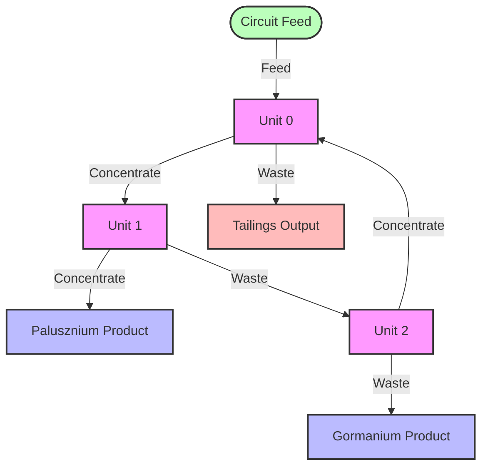
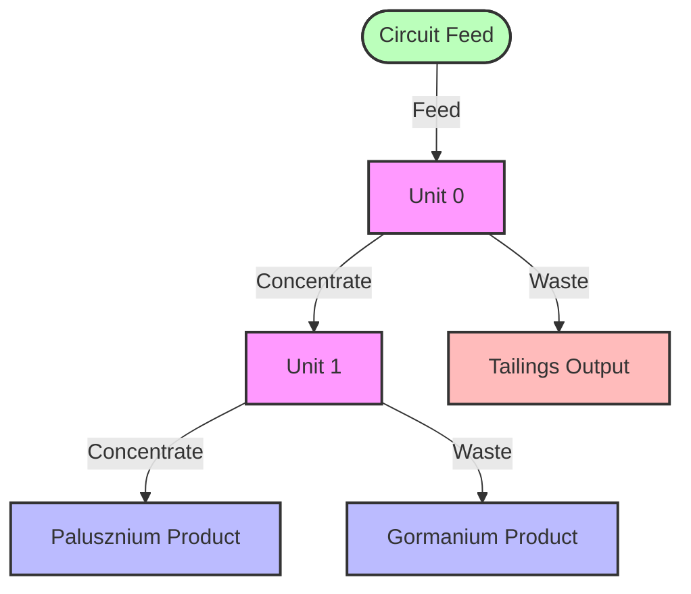
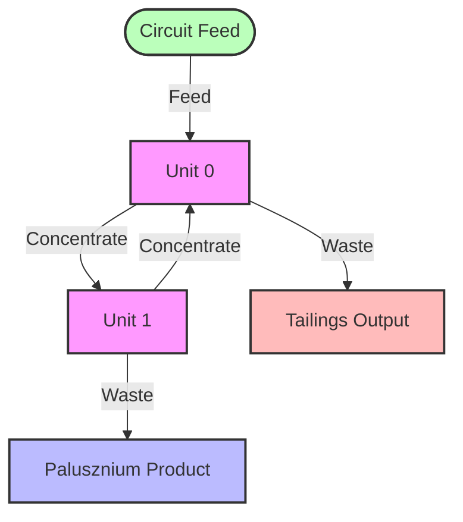
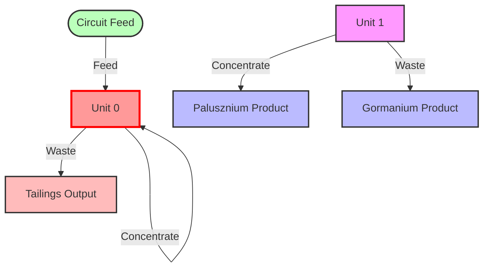

# Data Structures and Circuit Representation

This document details the data structures and circuit representation methods used in the project, serving as a common reference for team members.

## 1. Circuit Vector Representation

Circuits are represented using integer vectors in the following format:

```
[feed_unit, unit0_conc, unit0_waste, unit1_conc, unit1_waste, ...]
```

Where:
- `feed_unit`: Index of the unit receiving the circuit feed (0 to num_units-1)
- `unitX_conc`: Destination of the concentrate stream from unit X
- `unitX_waste`: Destination of the waste stream from unit X

Destinations can be:
- `0` to `num_units-1`: Index of the unit receiving the stream
- `-1` (PALUSZNIUM_PRODUCT): Final Palusznium concentrate product
- `-2` (GORMANIUM_PRODUCT): Final Gormanium concentrate product
- `-3` (TAILINGS_OUTPUT): Final tailings output

### Example

For a circuit with 3 units, a vector might be:
```
[0, 1, -3, -1, 2, 0, -2]
```

This represents:
- Feed enters unit 0
- Concentrate stream from unit 0 goes to unit 1
- Waste stream from unit 0 goes to tailings output
- Concentrate stream from unit 1 goes to Palusznium product
- Waste stream from unit 1 goes to unit 2
- Concentrate stream from unit 2 goes to unit 0
- Waste stream from unit 2 goes to Gormanium product

#### Visual Representation



## 2. Key Data Structures

### 2.1 Separation Unit (CUnit)

The `CUnit` class represents a single separation unit, containing the following key properties:

- Connection properties:
  - `conc_num`: Unit connected to concentrate stream
  - `waste_num`: Unit connected to waste stream
  - `mark`: Boolean flag used during graph traversal

- Physical properties:
  - `volume`: Unit volume (m³)
  - Feed flow rates: `feed_palusznium`, `feed_gormanium`, `feed_waste`
  - Separation constants: `k_palusznium`, `k_gormanium`, `k_waste`

### 2.2 Circuit (Circuit)

The `Circuit` class represents the entire separation circuit, with key functions:

- Initialize circuit configuration from circuit vector
- Check circuit validity
- Run mass balance calculations
- Calculate economic value of the circuit
- Calculate recovery and grade metrics
- Generate visualization output

### 2.3 Simulator Parameters (Simulator_Parameters)

The `Simulator_Parameters` structure contains all parameters needed for simulation:

- Convergence parameters: `tolerance`, `max_iterations`
- Material properties: `material_density`, `solids_content`
- Separation constants: `k_palusznium`, `k_gormanium`, `k_waste`
- Feed flow rates
- Economic parameters
- Unit volume parameters
- Visualization options

### 2.4 Genetic Algorithm Parameters (Algorithm_Parameters)

The `Algorithm_Parameters` structure contains all genetic algorithm parameters:

- General parameters: `max_iterations`, `population_size`, `elite_count`
- Selection parameters: `selection_pressure`
- Crossover parameters: `crossover_probability`, `crossover_points`
- Mutation parameters: `mutation_probability`, `mutation_step_size`
- Termination criteria: `convergence_threshold`, `stall_generations`
- Debug options: `verbose`, `log_results`

### 2.5 Circuit Vector (CircuitVector)

The `CircuitVector` class provides a convenient interface for working with circuit vectors:

- Constructors for empty or specified-size vectors
- Get/set unit connections
- Random generation of valid circuits
- Import/export circuit configurations

## 3. Interfaces and Function Signatures

### 3.1 Circuit Validity Check

```cpp
bool Circuit::check_validity(int vector_size, const int* circuit_vector);
```

### 3.2 Circuit Performance Evaluation

```cpp
double circuit_performance(int vector_size, int* circuit_vector, 
                        int unit_parameters_size, double* unit_parameters,
                        Simulator_Parameters simulator_parameters);
```

### 3.3 Optimization Function

```cpp
int optimize(int int_vector_size, int* int_vector,
            std::function<double(int, int*)> func,
            std::function<bool(int, int*)> validity,
            Algorithm_Parameters algorithm_parameters);
```

## 4. Global Constants

All global constants are defined in `constants.h`, including:

- Physical constants: material density, solids content, separation constants
- Economic parameters: product values, waste penalties, operating costs
- Default feed flow rates
- Circuit parameters: unit volumes, circuit volume limits
- Simulation parameters
- Genetic algorithm parameters

## 5. Circuit Validity Rules

Valid circuits must satisfy the following conditions:

1. Every unit must be accessible from the feed
2. Every unit must have a path to at least one outlet product stream
3. No self-recycling (a unit's output cannot connect directly back to itself)
4. Concentrate and waste from a unit should not point to the same destination

Circuits that violate these conditions may fail to converge or be physically unreasonable. 

## Appendix A: Common Circuit Configurations

### A.1 Simple Series Circuit

Vector: `[0, 1, -3, -1, -2]`



### A.2 Circuit with Recycle

Vector: `[0, 1, -3, 0, -1]`



### A.3 Invalid Circuit (Self-Recycle)

Vector: `[0, 0, -3, -1, -2]`



Note: This circuit is invalid because Unit 0 has a self-recycle connection (concentrate stream feeds back to itself). 