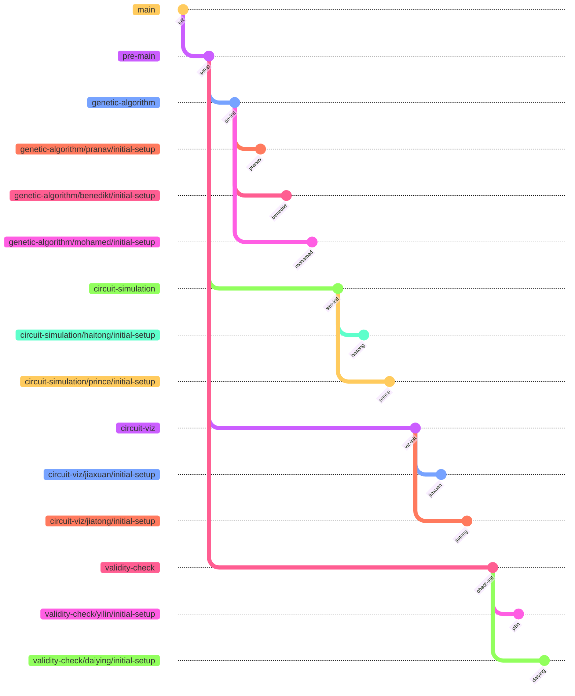

# Development Guide

## 1. Branch Structure

### 1.1 Core Branches

The project maintains four core development branches, all based on the `pre-main` branch:



- `genetic-algorithm`: Genetic algorithm optimization development

### 1.2 Branch Naming Convention

For feature development, use the following naming pattern:
```
<core-branch>/<member-name>/<feature-name>
```

Examples:
- `genetic-algorithm-dev/alice/crossover-optimization`
- `circuit-simulation-dev/bob/flow-calculation`
- `circuit-viz-dev/charlie/d3-integration`
- `validity-check-dev/david/cycle-detection`

## 2. Development Workflow

### 2.1 Branch Merging Path

The project follows a structured merging path to ensure code quality and integration:

1. Personal Development Branch → Feature Branch
   ```bash
   # Example: Merging from personal branch to genetic-algorithm
   git checkout genetic-algorithm/pranav/initial-setup
   git pull origin genetic-algorithm/pranav/initial-setup
   # Create PR to merge into genetic-algorithm
   ```

2. Feature Branch → pre-main
   ```bash
   # After feature is complete and tested
   git checkout genetic-algorithm
   git pull origin genetic-algorithm
   # Create PR to merge into pre-main
   ```

3. pre-main → main (Production)
   ```bash
   # Only after thorough testing and review
   git checkout pre-main
   git pull origin pre-main
   # Create PR to merge into main
   ```

Merging Rules:
- Personal branches (`*/member/feature`) should only merge into their respective feature branch
- Feature branches (`genetic-algorithm`, `circuit-simulation`, etc.) merge into `pre-main`
- `pre-main` is the integration branch where all features are tested together
- `main` is the production branch, only accepting well-tested code from `pre-main`

### 2.2 Starting New Development

1. Choose the appropriate core branch for your feature
2. Create your feature branch:
   ```bash
   git checkout <core-branch>
   git pull origin <core-branch>
   git checkout -b <core-branch>/<your-name>/<feature-name>
   ```

### 2.3 Development Process

1. Make regular commits with meaningful messages:
   ```bash
   git commit -m "feat(<scope>): <description>"
   ```

2. Keep your branch updated:
   ```bash
   git fetch origin
   git rebase origin/<core-branch>
   ```

3. Push your changes:
   ```bash
   git push origin <your-branch-name>
   ```

### 2.4 Synchronizing with Main Branch

1. Regularly sync your feature branch with main:
   ```bash
   # First, save your current work
   git stash  # If you have uncommitted changes
   
   # Update main branch
   git checkout main
   git pull origin main
   
   # Update your core branch
   git checkout <core-branch>  # e.g., genetic-algorithm-dev
   git merge main
   git push origin <core-branch>
   
   # Update your feature branch
   git checkout <your-feature-branch>
   git merge <core-branch>
   
   # Restore your work if stashed
   git stash pop  # If you stashed changes
   ```

2. Resolve any conflicts:
   - If conflicts occur during merge, Git will mark the files
   - Resolve conflicts in each file
   - Use `git add <file>` for each resolved file
   - Complete the merge with `git commit`

3. Best practices:
   - Sync with main at least once per week
   - Always sync before starting new features
   - Sync immediately when critical updates are announced
   - Test thoroughly after syncing

### 2.5 Code Review Process

1. Create a Pull Request (PR) to merge into your core branch
2. Request reviews from at least two team members
3. Address review comments and update PR
4. Merge only after receiving approvals

## 3. Coding Standards

### 3.1 Commit Message Format

Follow the Conventional Commits specification:

- `feat`: New feature
- `fix`: Bug fix
- `docs`: Documentation changes
- `style`: Code style changes
- `refactor`: Code refactoring
- `test`: Adding or modifying tests
- `chore`: Maintenance tasks

Example:
```
feat(genetic): implement tournament selection
fix(simulation): correct mass balance calculation
docs(readme): update installation instructions
```

### 3.2 Code Style

- Use clear and descriptive variable/function names
- Add comments for complex algorithms
- Follow the existing code formatting
- Write unit tests for new features
- Document public APIs and functions

## 4. Testing Guidelines

### 4.1 Unit Testing

- Write tests for new features before implementation (TDD)
- Maintain test coverage above 80%
- Run tests locally before pushing:
  ```bash
  # Example for C++ (CMake/CTest)
  # mkdir build && cd build && cmake .. && make && ctest
  # Example for Python (pytest)
  # pytest
  # Or, using unittest
  # python -m unittest discover
  ```

### 4.2 Integration Testing

- Add integration tests for core functionality
- Test interactions between different modules
- Verify circuit validation rules
- Check simulation convergence

## 5. Documentation

### 5.1 Code Documentation

- Use Doxygen style comments for C++ and Sphinx/Epydoc style comments for Python.
- Document parameters and return values
- Explain complex algorithms
- Keep documentation up to date with code changes

### 5.2 Project Documentation

- Update README.md for new features
- Document API changes
- Maintain architecture diagrams
- Add usage examples

## 6. Deployment and Release

### 6.1 Release Process

1. Version bump following semver
2. Update CHANGELOG.md
3. Create release branch
4. Deploy to staging
5. Run full test suite
6. Deploy to production

### 6.2 Version Control

Follow Semantic Versioning (SemVer):
- MAJOR version for incompatible API changes
- MINOR version for new functionality
- PATCH version for bug fixes

## 7. Issue Tracking

### 7.1 Issue Labels

- `bug`: Something isn't working
- `enhancement`: New feature or request
- `documentation`: Documentation improvements
- `help wanted`: Extra attention needed
- `good first issue`: Good for newcomers

### 7.2 Issue Template

```markdown
## Description
[Describe the issue]

## Expected Behavior
[What should happen]

## Current Behavior
[What happens instead]

## Steps to Reproduce
1. [First Step]
2. [Second Step]
3. [and so on...]

## Environment
- OS: [e.g. macOS]
- Version: [e.g. 1.0.0]
```

## 8. Contact and Support

- Project Lead: [Name]
- Technical Lead: [Name]
- Documentation: [Link]
- Team Channel: [Link]

## 9. Additional Resources

- Project Wiki: [Link]
- API Documentation: [Link]
- Development Environment Setup: [Link]
- Troubleshooting Guide: [Link] 